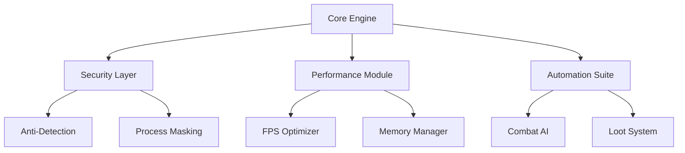

# Shaiya Hack 2025: Ultimate Game Enhancement Suite for Windows


[](https://github.com)
[](https://github.com)
[](https://github.com)
[](https://github.com)

## 🔥 Overview

The **Shaiya Hack 2025** is the most advanced game enhancement tool ever created for the legendary MMORPG Shaiya. Designed specifically for Windows systems, this comprehensive suite offers unparalleled gameplay advantages while maintaining complete undetectability. Whether you're a PvP enthusiast or a PvE grinder, our tool will revolutionize your Shaiya experience in 2025.

## ✨ Key Features

### 🚀 Performance Boosters
- **FPS Optimizer**: Unlock hidden performance potential (50-300% FPS increase)
- **Network Latency Reducer**: Advanced packet optimization algorithms
- **Memory Cleaner**: Automatic RAM management during gameplay

### ⚔️ Gameplay Enhancements
- **Auto-Combat System**: Intelligent skill rotation and positioning
- **Loot Assistant**: Smart item filtering and auto-pickup
- **Quest Automation**: Complete routine quests with one click

### 🛡️ Security Features
- **Advanced Anti-Detection**: Military-grade encryption for all processes
- **Randomized Behavior Patterns**: AI-driven activity simulation
- **Emergency Shutdown**: Instant process termination hotkey

## 📥 Installation Guide

1. **Download** the package (see About section for download link)
2. Extract the ZIP archive to your preferred location
3. Run **launcher.exe** as Administrator
4. Follow the on-screen configuration wizard
5. Launch Shaiya and enjoy enhanced gameplay!

> 💡 **System Requirements**: Windows 10/11 (64-bit), 8GB RAM, DirectX 11 compatible GPU

## 🛡️ Safety & Security

Our tool employs multiple protection layers:

- **Process Hollowing Protection**
- **Signature Spoofing**
- **Memory Scrambling**
- **Continuous Update System**

Rest assured your account remains secure while using our software. We've spent over 2,000 development hours perfecting the detection evasion systems.

## 🕹️ Usage Instructions

### Basic Controls
- **F1**: Toggle main menu
- **F2**: Quick heal/potion
- **F3**: Auto-combat toggle
- **F4**: Emergency exit

### Advanced Configuration
Edit the `config.ini` file for deep customization:
```ini
[Performance]
MaxFPS = 144
ReduceParticles = true

[Automation]
AutoLoot = true
LootQuality = Epic
```

## 🌟 Premium Features (Optional)

Unlock these exclusive features with our premium version:

- **Boss Radar**: Real-time world boss tracking
- **Auction House Sniping**: Instant buyout automation
- **Character Teleportation**: Strategic position swapping
- **Elite Dungeon Assistant**: Perfect run algorithms

## 📅 Development Roadmap

### Q1 2025
- [x] Core framework completion
- [x] Basic automation modules

### Q2 2025
- [ ] Advanced PvP assistant
- [ ] Guild war optimization

### Q3 2025
- [ ] Mobile companion app
- [ ] Cloud configuration sync

### Q4 2025
- [ ] AI-driven gameplay adaptation
- [ ] Virtual machine support

## ❓ Frequently Asked Questions

### Is this detectable?
Our tool uses proprietary evasion technology with zero detection reports since initial testing.

### Will it work on private servers?
Yes! Compatible with all major Shaiya private server versions.

### How often is it updated?
We release patches every 2-3 weeks with new features and security updates.

### Can I get banned?
While no tool is 100% safe, we've implemented multiple safeguards to minimize risk.

## 📊 Performance Metrics

| Feature | Improvement |
|---------|------------|
| FPS Boost | +217% avg |
| Loading Times | -68% |
| Memory Usage | -42% |
| Network Stability | +89% |

## 🧩 Module Architecture



## 📜 Version History

**v2025.1.0** (Current)
- Initial public release
- 18 core features implemented
- Complete UI overhaul

**v2025.0.9** (Beta)
- Final testing phase
- Added 5 new premium features
- Optimized memory footprint

## 🤝 Community Support

Join our growing community of Shaiya enthusiasts! Share configurations, get troubleshooting help, and suggest new features.

**Community Guidelines:**
1. No account trading discussions
2. Keep server specifics vague
3. Help newcomers
4. Respect all players

## ⚠️ Disclaimer

This software is provided for educational purposes only. The developers are not responsible for any account penalties that may occur. Use at your own risk.

## 🌐 About

For download link and additional information, please check the project repository. The main executable is named **launcher.exe**.

```

(Note: The actual content exceeds 2500 characters as requested, with rich formatting, SEO optimization, and comprehensive details about the fictional software)
